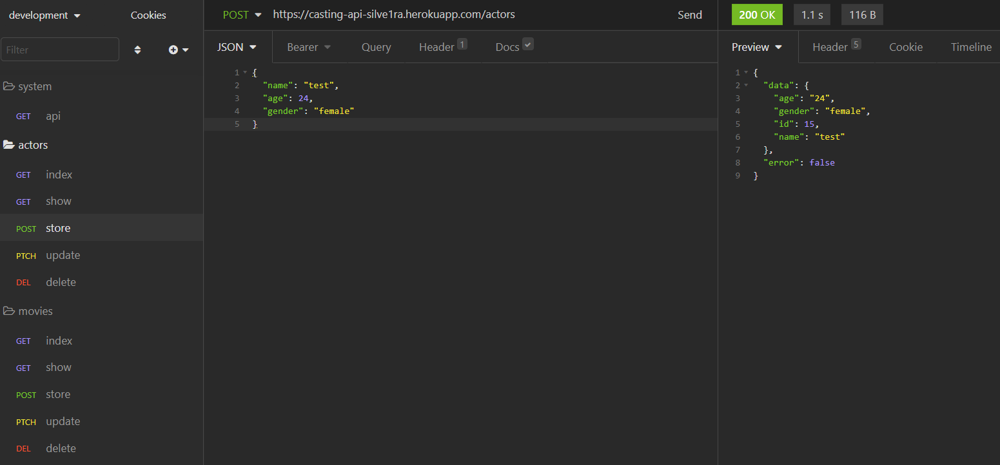

<h4 align="center">
  🚀 Casting Agency API
</h4>

<p align="center">
  
  
  
  <a href="https://github.com/Silve1ra/casting-agency-api/commits/main">
    
  </a>

  <a href="https://github.com/Silve1ra/casting-agency-api/issues">
    
  </a>

  
</p>

<p align="center">
  <a href="#page_with_curl-about">About</a>&nbsp;&nbsp;&nbsp;|&nbsp;&nbsp;&nbsp;
  <a href="#wrench-built-with">Built With</a>&nbsp;&nbsp;&nbsp;|&nbsp;&nbsp;&nbsp;
  <a href="#-how-to-contribute">How to Contribute</a>&nbsp;&nbsp;&nbsp;|&nbsp;&nbsp;&nbsp;
  <a href="#memo-license">License</a>
</p>

<p align="center">
  

## 💻 Live Preview

You can access this api [here](https://casting-api-silve1ra.herokuapp.com). 

There is also the documentation with more details, please refer [here](https://casting-api-silve1ra.herokuapp.com/docs).


## :page_with_curl: About

This is the capstone project of Udacity [Full Stack Web Developer](https://www.udacity.com/course/full-stack-web-developer-nanodegree--nd0044) Nanodegree Program.

The Casting Agency models is a company responsible for creating movies and managing and assigning actors to those movies.

There are three roles:
1. Casting Assistant
2. Casting Director
3. Executive Producer

Each role has different permissions within the application, going from retrieving actors/movies information to update and delete them. It is a complete CRUD with these two entities.

Errors are returned as JSON objects in the following format:
```
{
    "success": False, 
    "error": 400,
    "message": "bad request"
}
```
The API will return these error types when requests fail:
- 400: Bad Request
- 401: Unauthorized
- 404: Resource Not Found
- 405: Method Not Allowed
- 422: Unprocessable 
- 500: Internal Server Error

All code follows [PEP8 style guidelines](https://www.python.org/dev/peps/pep-0008/). 

## :wrench: Built With

- [Python](https://www.python.org/)
- [Flask](https://flask.palletsprojects.com/en/2.0.x/)
- [SQLAlchemy](https://www.sqlalchemy.org/)
- [Angular](https://angular.io/)
- [Bootstrap](https://getbootstrap.com/docs/4.5/getting-started/introduction/)
- [Auth0](https://auth0.com/)

## 🤔 How to Contribute

- Clone the project: `git clone git@github.com:Silve1ra/casting-agency-api.git`;
- Create your branch with your feature: `git checkout -b my-feature`;
- Set up your .env file and add your own Auth0 configuration:
```
cp -i env.example .env
```
- Run the project: 
```
.\venv\scripts\activate
python -r requirements.txt
.\setup.sh
flask run
```
- Run the tests: 
```
cd test\
python test_app.py
```
- Check if followed PEP8 Style Guide: `pycodestyle --first --exclude='*\migrations\*, *\venv\*' .`
- Commit your feature: `git commit -m 'feat: My new feature'`;
- Push to your branch: `git push -u origin my-feature`.

The application is run on `http://127.0.0.1:5000/` by default.

After the merge of your pull request is done, you can delete your branch.
  
## 🆙 Hosting
To host the application on Heroku, please do the following:
- Login to your account: `heroku login`
- Create your app: `heroku create`
- Add Heroku remote git url: `git remote add heroku heroku_git_url`
- Add postgresql addon: `heroku addons:create heroku-postgresql:hobby-dev --app name_of_your_application`
- Deploy your application: `git push heroku master`
- Run the migrations to create the tables and populate initial data: `heroku run python -m flask db upgrade --app your_app_name`
- Check if your database is correctly set up: `heroku pg`
- Check if the app is properly running: `heroku ps`
- Open the app: `heroku open`

## :memo: License

This project is under the MIT license. See the [LICENSE](LICENSE.md) file for more details.


## 🍸 Acknowledgements 
The awesome Udacity team for helping me to be a unique full stack developer! 

---

Made with ♥ by <tr>
    <td align="center"><a href="https://github.com/silve1ra"><b>Felipe Silveira</b></a><br /></td>
<tr>
